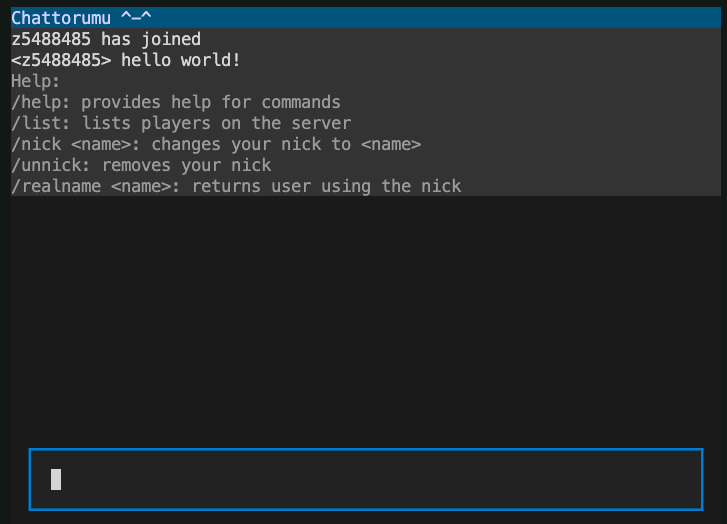

# <p style="text-align: center;">`Chattorumu`</p>

## About the project


Chattorumu is a terminal-based minimal chat application. It is made with Python's standard libraries like `asyncio` and `signal`, and 

- **Textual**,
- **PyInstaller**.

## Getting started
To setup the project locally, follow these steps.

### Prerequisites
- Python
```
brew install python      # macOS
sudo pacman -S python    # Linux
choco install python     # Windows
```

### Installation
- Setup a Python virtual environment if needed
- Install third-party packages
```
pip install -r requirements.txt
```
- Update `config.py` with your configuration. It is recommended to at least update `LOG_PATH` and `CLIENT_HOST`.

### Usage
- Start the server
```
python3 src/server.py
```
- Launch the client
```
python src/chattorumu.py
```

### Building
This section describes how to build the frontend/client. Building the server will be left as an exercise for the reader.

- Run the build script
```
chmod +x build_chattorumu
./build_chattorumu
```
The executable will be located in `dist/`. Be sure to give both execute AND read permissions to anyone intended to use the app.
```
chmod o+rx dist/chattorumu
```

### Roadmap

- [x] Server to reject duplicate names
- [x] Server and client to use custom packets
- [x] Join and leave messages
- [x] Serer to log to chat file
- [x] New commands: /help, /message, /list, /nick
- [ ] (Client) arrow key command history
- [ ] Color support for log file for PACKET_IN and PACKET_OUT levels
- [ ] DIsable listview clnicking
- [ ] Color support for system messages, nicks, etc
- [ ] New commands: /message, /ping


### Contributing
Contributions are what make the open source community such an amazing place to learn, inspire, and create. Any contributions you make are **greatly appreciated**.

If you have a suggestion that would make this better, please fork the repo and create a pull request. You can also simply open an issue with the tag "enhancement". Don't forget to give the project a star! Thanks again!

1. Fork the project
2. Create your Feature Branch (`git checkout -b feature/AmazingFeature`)
3. Commit your changes (`git commit -m 'Add some AmazingFeature'`)
4. Push to the branch (`git push origin feature/AmazingFeature`)
5. Open a Pull Request

### License
Distributed under the MIT licence. See `license.txt` for more information.

### Contanct
- Discord: `continuo`
- Project link: https://github.com/Chinosu/chattorumu

### Acknowledgements
- Jayden (he's the best)!
